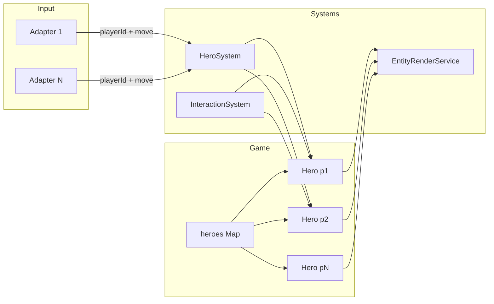

# Multiplayer — What to change

## Product model: Diablo 4–style (offline / online, party, persistence)

The game supports **offline mode** and **online mode**. Reference: research how **Diablo 4** handles world instances, sharding, and party flow so we align with that model.

**Offline mode**

- Single-player only. Nobody else in your world. Progress is saved to the **player’s save file** (local / account when applicable).

**Online mode**

- **Solo online:** When you play online and are **not** in a party, you are in **your own world** — you are the world owner. Your unlocks and progression; randoms can appear only in non-progression zones (see World instance below).
- **Persistent world:** You have your own game world progress. You are placed in a world instance where **other random players** can be present — you run into them as you play (Diablo 4–style). There is no “session” that starts and ends; people drop in and out.
- **Party (new feature):** **Party size = 4.** You **invite** someone to join your party while in the game. When they accept, they join **your** world and stay in your world (like Diablo 4). So the world can have many characters in it, but your **party** is up to 4 invited members who are always in your world until they leave. **Friend list** (storage, UI, invite flow) is scoped for later.
- **No lobby/ready-up:** It’s a persistent world; people drop in and out. No “start session” screen.
- **No pause, no kick:** The game does not pause. No kick feature for now; if a player doesn’t want to play with others, they play offline. There is no “end session” — when online, others come and go; friends who join your game stay in your world.

**Progress**

- **Progress = what the player chooses to do** (e.g. buying upgrades, unlocks). There is **no campaign progression** (no story quests to borrow or share). **Quest progress** means simple objectives (e.g. "gather 5 wood for a small reward"); these are per-player and stored in their save. Progress is how the player upgrades or manipulates their world.

**Persistence**

- **Saved to player’s save file / account.** Progress (inventory, gold, unlocks, XP, etc.) is **always** being saved to the player’s data. Reconnection means loading from that saved state; rejoin token / session id (see "Rejoin and session" below) lets you rejoin the same instance when you disconnect. Offline and online use the same save file (one source of truth); no special “reconnect to same session” — the world and account state are the source of truth.

**Cross-platform**

- **Steam, Google Play, and Web** players can be in the same world (cross-platform allowed).

**Unlocks and economy**

- **Each player has their own unlocks and gold.** The unlock system will need to be **reworked** so that island/world unlocks are per-player, not shared (e.g. each player spends their own gold to unlock islands on their own progress).

**Loot**

- **Range-based instanced loot:** When an enemy dies, **players within a certain range** of the death get their **own** loot roll; loot is granted per-player into their inventory (instanced). No shared pile on the ground.

**Respawn**

- **Respawn at the outpost** as normal (no special party respawn or cost).

**Implement later (not in initial scope)**

- Waypoints / pings for party.
- Quick chat / emotes.
- Difficulty scaling by player count.
- No ping indicator, no session summary screen, no grace period for new joiners (they spawn at home outpost as normal, which has no enemies).

**Accepted suggestions**

- **Server-side validation and rate limits** (Section 2): Validate movement, damage, and inventory on the server; rate-limit input.
- **Server config and logs:** Use config (env/file) for server URL, max players, tick rate; log connections and major events for ops.

---

## Recommended order: networking first, split-screen later

- **Phase 1:** Scope for networking + multi-hero (playerId, serializable state, events, input routing). No server yet.
- **Phase 2:** Implement dedicated server; localhost in dev, production URL when we ship. Two clients (e.g. localhost:5173 and localhost:5174) for testing.
- **Phase 3 (optional):** Local split-screen later if desired.

## Current single-player assumptions

- **Single hero reference:** [Game.ts](src/core/Game.ts) has `hero: Hero | null`; [IGame](src/types/core.d.ts) exposes `hero: IEntity | null`.
- **Spawn:** [SpawnManager](src/systems/SpawnManager.ts) creates one Hero, sets `game.hero`, calls `GameRenderer.setHero(hero)`, adds to EntityManager.
- **Input:** [InputSystem](src/input/InputSystem.ts) emits a single `INPUT_MOVE` / `INPUT_ACTION`; [HeroSystem](src/systems/HeroSystem.ts) applies it to `game.hero`.
- **Camera:** [GameRenderer](src/core/GameRenderer.ts) holds one `hero` and centers the viewport on it.
- **Rendering:** [EntityRenderService](src/rendering/EntityRenderService.ts) treats “the” hero specially (`entity === renderers.hero`) and uses HeroRenderer only for that reference.
- **UI:** Inventory, equipment, HUD, minimap use `GameInstance?.hero` or `this.game?.hero` (single hero).
- **Drops:** [InteractionSystem](src/systems/InteractionSystem.ts) uses `this.game.hero` for pickup/magnet; `collectItem(hero, item)` already adds to that hero’s inventory (per-hero logic exists).
- **Events:** Many events carry `{ hero }` (e.g. HERO_DIED, HERO_STAMINA_CHANGE, REQUEST_STAMINA_RESTORE); no player identifier.
- **Enemy AI / targeting:** Uses `entityManager.getByType('Hero')?.[0]` or `GameInstance?.hero` (first hero).
- **Hero identity:** [Hero](src/gameplay/Hero.ts) constructor uses fixed `id: 'hero'`; with multiple heroes, IDs must be unique.

Roughly **25+ files** reference `game.hero` or `GameInstance.hero` (see grep results); all need to work with “a set of heroes” and “local player’s hero(es)” instead of a single global hero.

---

## Target: multi-hero, persistent world, party of 4

- **World:** Can have many characters (random players + your party). **Party size = 4** — you invite friends to join your party in-game; they then stay in your world.
- **Per-player:** Each hero has **own inventory, gold, unlocks, equipment, health, XP, respawn**. Unlock system must be **reworked** so unlocks (e.g. islands) and gold are per-player.
- **Implementation order:** Scope for networking first; implement dedicated server (localhost in dev); ship with production server. Optional: local split-screen later.

---

## World instance and world owner (one player's world state)

A **world instance** is based on **one player's world state** (unlocks, island progression, etc.). That player is the **world owner** for that instance.

**When you invite or when people join you**

- They play in **your** world. They see **your** unlocks and **your** world progression, even if the joiner has progressed further in their own save. The joiner's progress does not override; the world is keyed to the inviter (world owner). Party members **stay in your world** everywhere — they don't load out when entering progression areas.

**When you join someone else**

- You are in **their** world. You see **their** unlocks and world state. You **stay in their world** (you're in their party); you don't switch back to your own progression when entering progression areas.

**Random online players (not in your party)**

- Randoms **only load in** for **world areas that do not have player-related progression** (e.g. shared/public zones with no unlocks). In those zones you can see other random players.
- When you or they move into **areas that do have player-related progression** (unlocked islands, home base, etc.), **random players load out** — you are in a progression instance (your world state, or the party leader's if you're in a party). Randoms do not appear in progression areas unless they are in your party (in which case they're in your world and stay).
- So: **non-progression zones** = randoms can appear and disappear as players move in/out. **Progression zones** = only the world owner (and their party) are present; no randoms.

**World owner leaves**

- If the **world owner** disconnects or leaves, **ownership transfers to another member** of the party (e.g. next in party list or first remaining member). The instance continues with the new owner's identity; world state remains that of the original owner (already loaded) until the instance is saved — then it is written back to the original owner's save. Subsequent changes in the instance can be written to the new owner if desired, or the instance can be treated as "orphaned" until everyone leaves; exact policy TBD (e.g. "transfer world state to new owner" vs "instance state is read-only for new owner until they leave").

**Progression zones**

- Exact definition of which areas are **progression** vs **non-progression** will be articulated later; some features are being redone.

**Summary**

- **World owner** = whose save's world state (unlocks, progression) defines the instance. When you invite or join a party, everyone uses that owner's world state; party stays in that world. If owner leaves, ownership transfers to another member.
- **Randoms** = only visible in non-progression areas; they load out when entering progression areas. When you re-enter a non-progression zone, you get a **re-match** (new set of randoms), not the same players. If they're in your party, they're no longer randoms — they're in your world and stay.

---

## Shared vs per-player: what’s shared, what’s unique

**Shared (in the same world instance):**

- **World instance:** Keyed to the **world owner's** state (see "World instance and world owner"). Islands, terrain, bridges — the same physical world. Everyone in that instance sees the **owner's** unlocks and progression for that world. Each player still has their own **save** (inventory, gold, XP, etc.); the **instance** uses the owner's world state. **Only the world owner can change world state** (unlocks, island upgrades, etc.) in that instance; party members cannot upgrade the owner's world — only their own things on their own world. When in someone's world you see their unlocks and use your own inventory/gold (e.g. buying at merchant = your gold), but any change to shared world state is owner-only and written to the owner's save. Unlock system must be **reworked** so (a) each player has their own save and (b) when in someone's world you see their unlocks.
- **Enemies:** Enemies exist once in the world. All players in range can see and attack the same enemies; when an enemy is killed, the server resolves it once (shared kill).

**Per-player (unique to each player):**

- **Inventory, gold, resources, equipment, XP, level, quest progress, respawn, unlocks.** Each hero has their own; no sharing. Progress is saved to the player's save file / account at all times.
- **Loot / drops:** **Range-based instanced loot.** When an enemy (or resource) dies, **players within a certain range** of the death get their **own** loot roll; rewards go directly into each of those players' inventories. No shared pile on the ground. The server decides who was in range and issues separate loot per player. **Resource nodes** (e.g. trees, rocks): when a node is "killed" or harvested, the same rule applies — each player in range gets their own loot roll (instanced); who triggered the harvest does not matter. **Loot range** is config-driven (TBD per enemy/node type or global).

---

## Player identity, auth, and save

**Stable player identity**

- **Account id** (stable, persistent): Identifies the player across sessions and devices. Used for save file, friend list, and "world owner" identity. Source: auth provider (e.g. Google) or your backend after sign-in.
- **Session playerId** (or entity id): Used during a session for input routing and entity keying (e.g. `hero_<accountId>` or a short session slot). The server maps session connection to account id; within the game loop, heroes are keyed so that persistence and world ownership use account id where needed.

**Authentication**

- **Sign-in:** Players sign in via **Google** (preferred for all platforms: Steam, Google Play, Web). Use Google Sign-In / OAuth; server verifies the token and associates the connection with an account id. No client trust: server never trusts client-reported identity for state changes.

**Save storage**

- **One save file per account** (same for offline and online). When offline, client reads/writes locally (e.g. localStorage or local file) under a single local identity (e.g. "default" or device-local id). **First-time online:** When a player who has only played offline signs in for the first time, upload/link their local save to the new account (local save becomes the account save). When online, server loads save from persistent storage (keyed by account id) when the player joins an instance and **constantly writes back** (periodic or on key events). **Multi-device conflict:** When reconnecting or going online from another device, prefer server timestamp wins (or refine later) so progress is not lost.

**Versioning**

- **Client and server must agree on protocol and game version.** Include a version field in the connection handshake or first message; server rejects or warns on version mismatch. Prefer failing connect on incompatible version so desyncs and crashes are avoided.

---

## Sharding and instance assignment

- **Solo online:** You are assigned to an instance keyed by **your account id** (your world). You are the world owner. Randoms in non-progression zones are matched into the same zone/shard (e.g. by region id or pool); when you enter a non-progression zone, the server places you in a shard for that zone and you see others in that shard.
- **Party:** When you invite or join, the instance is keyed by the **party leader's (world owner's) account id**. Everyone in the party is in that instance. Randoms never appear in progression zones of that instance; in non-progression zones, the party shares the zone with randoms (re-match when re-entering).
- **World state:** Loaded from the **owner's persisted save** when the instance is created. **Constantly written back** to the owner's save (periodic or on key events) so the owner's progress is never lost. If ownership transfers (owner leaves), the instance continues; write-back policy for the new owner TBD (e.g. write to original owner's save until instance ends, or transfer write-back to new owner).

**Rejoin and session**

- Support **rejoin token / session id**. When a client disconnects, the server keeps their slot in the instance for a short **configurable** timeout (e.g. 2–5 minutes; in server config so ops can tune). The client can reconnect with the same session id (or token) and rejoin the same instance and hero without losing place. After timeout, the slot is released and the player must join again (they will load from their saved state into a new or existing instance as appropriate).

**Instance teardown**

- When the instance is **empty** (e.g. last party member leaves, or owner left and party dissolved), the instance is torn down. World state has already been written back to the owner's save before teardown.

---

## Policies and edge cases

- **Party full (4/4):** No fifth invite. If the owner tries to invite when party is full, show "Party full" (or equivalent); do not allow swap without an explicit kick flow (kick is out of scope for now).
- **Dual invite:** If A invites B and B invites A at the same time, **whoever accepts first wins** — that acceptance determines who joins whose world. The other invite can be cancelled or ignored.
- **Randoms re-match:** When you re-enter a non-progression zone, you get a **re-match** (new set of random players in that zone), not the same players as before.

**Client error handling and UX**

- Client should show clear states for: **connection lost** (e.g. "Connection lost. Reconnecting…" using rejoin token), **session expired** (after rejoin timeout), **version mismatch** (e.g. "Please update the game"), and **server full** (if applicable). Fail connect on incompatible version so desyncs are avoided.

**Dev testing: second client without friend list**

- During dev tests, the second player is **by default** the client that loads from the second URL/port (e.g. localhost:5174). No join-by-code or friend list required for testing; loading from that port is treated as a second player in the same (local) instance.

---

## Development vs ship: localhost now, dedicated server when we ship

**During development:** Run the **authoritative game loop on localhost** (same machine as the client, or a local server process). No deployed server yet.

- **Player 1:** Runs the game at **[http://localhost:5173](http://localhost:5173)** (existing Vite dev server). This client connects to the local game server (e.g. `ws://localhost:3xxx` or same origin if server is bundled/proxied).
- **Player 2 (second tester):** Use a **different URL** so the browser treats it as a second client — e.g. **[http://localhost:5174](http://localhost:5174)** (second Vite dev server port) or **[http://127.0.0.1:5173](http://127.0.0.1:5173)** vs **[http://localhost:5173](http://localhost:5173)** (sometimes different origins), or a simple second HTML entry that connects to the same local server. Goal: two browser tabs/windows that are two different “clients,” both talking to the same local server.
- **Local server:** One process (Node or similar) runs the game loop and WebSocket server; dev config points both clients at `ws://localhost:<port>`. When you add Phase 2 networking, this is the same server code, just running locally.

**When we ship:** Clients connect to the **dedicated server** URL (e.g. `wss://game.yourdomain.com`). No code change to game logic; only the **server URL** (and env/build config) switches from localhost to production. Finalize and deploy the dedicated server at that time.

---

## Google Play and Steam: do we need a server or P2P?

**Google Play and Steam are distribution only.** They don’t run your game logic or host your sessions. You choose who runs the authoritative game: a **dedicated server** (you host) or **peer-to-peer** (one player hosts).

### Option A: Dedicated server (you host)

- **How it works:** You run a server process (e.g. Node, Go) on a VPS or cloud (AWS, GCP, etc.). All clients — Steam desktop, Android (Google Play), Web — connect **to your server** via WebSockets (WSS). The server runs the game loop and is the single source of truth.
- **Google Play:** Same client code; connects to your server URL. No special “Google server” for your game.
- **Steam:** Same; Steam is the store/launcher. Your game still connects to your server (or you can use Steam’s relay for NAT traversal while still using your server as authority).
- **Pros:** No host advantage; no “host quit = game over”; works behind NAT; one machine can handle 16 players; you can add matchmaking, persistence, anti-cheat.
- **Cons:** You pay for hosting and need to operate the server.

### Option B: Peer-to-peer (one player is host)

- **How it works:** One player’s client runs the authoritative game loop (they are “host”); other players connect **to the host**. Host’s machine receives input from peers and broadcasts state. No separate server process.
- **Google Play / Web:** Use **WebRTC** (P2P data channels) so peers connect to the host. Often you need a **signaling server** (tiny: just exchanges connection info) and optionally **TURN** (relay when NAT blocks direct P2P). Signaling can be minimal (e.g. Firebase, or a tiny server you run).
- **Steam:** Use **Steamworks P2P** (Steamworks Networking Sockets). Steam provides matchmaking and relay so the host doesn’t need to be directly reachable. No TURN needed; Steam handles NAT.
- **Pros:** No game-server hosting cost; quick to ship for small groups.
- **Cons:** Host disconnect can end or disrupt the session; host has lower latency and could cheat; hosting 16 players from a home connection is often unreliable (bandwidth/cpu). Best for 2–4 players.

### Option C: P2P with relay (still P2P authority)

- Same as B, but a **relay** (e.g. Steam Datagram Relay, or a TURN server for WebRTC) forwards packets so the host doesn’t need a public IP. Authority is still the host’s game; you’re not running the game loop on the relay. Good for NAT traversal; doesn’t remove host-disconnect or host-advantage issues.

### Recommendation for this game (Diablo 4–style, Steam + Google Play + Web)

| Goal                                  | Suggested approach                                                                                                                                                                                                  |
| ------------------------------------- | ------------------------------------------------------------------------------------------------------------------------------------------------------------------------------------------------------------------- |
| **2–4 players, minimal cost**         | P2P with one player as host. Steam: Steamworks P2P. Web/Android: WebRTC + small signaling (and TURN if needed). Same game code: “authority” runs the same loop whether it’s a dedicated process or the host client. |
| **Up to 16 players, stable sessions** | Dedicated server. All platforms connect to your server over WebSockets. You run the game loop on the server; clients send input and render state.                                                                   |
| **Hybrid**                            | Implement authority so it can run in either a **dedicated process** or the **host client**. Ship P2P first (no server cost); add a dedicated-server build later for larger or more competitive play.                |

**We are using a dedicated server.** The product model (persistent online world, random players, party of 4, per-player progress, cross-platform) requires a central authority and always-on world state. All clients connect to your server over WebSockets. Research Diablo 4 for world instances, sharding, friend list, and party flow.

**Bottom line (legacy):** You do **not** need a server for basic online play — P2P with host is enough for small groups on both Steam and Google Play. You **do** need a server (or a relay + host) for connectivity (signaling/TURN or Steamworks). For 16 players or persistent/fair sessions, a dedicated server is the better long-term choice. The Phase 1/2 design (playerId, serializable state, input → authority) works for both P2P host and dedicated server; only where the “authority” process runs changes.

---

## Phase 1: Scope for networking + multi-hero (no network stack yet)

Goal: Make the codebase **ready for networking** and multi-hero. Every hero has a playerId; state is serializable; events carry playerId/entity id; input is playerId + intent. We still run on one machine (e.g. one local hero for testing, or multiple simulated heroes). No server or wire protocol yet — but no design choices that would block Phase 2.

### 1.1 Player and hero identity

- **Account id** (stable): Used for persistence, world ownership, and friend list. Set when the player signs in (e.g. Google). See "Player identity, auth, and save" above.
- **Session playerId / entity id:** Used during a session for input routing and entity keying (e.g. `hero_<accountId>` or short slot id). For local dev without auth, use placeholders (e.g. `"local"`, `"p2"`).
- Every **Hero** must carry a **playerId** (session or account as appropriate) and a unique **entity id** (e.g. `hero_${playerId}`).
- Add a **“local player”** concept: which playerId(s) are controlled by this client (e.g. `["local"]` or `["local","p2"]` for couch co-op).

**Files:** [Hero.ts](src/gameplay/Hero.ts) (accept `playerId` and `id` in config), [EntityTypes](src/config/EntityTypes.ts) (Hero type already exists).

### 1.2 Game state: from single hero to hero set

- Replace `game.hero` with a **hero set**:
  - e.g. `game.heroes: Map<string, Hero>` or `Hero[]` plus `game.getHero(playerId)`, `game.getLocalHeroes()`, `game.getHeroes()`.
- **Backward compatibility:** `game.hero` can become a getter that returns the first local hero or a designated “primary” hero for code that is not yet migrated (then migrate call sites and remove).

**Files:** [Game.ts](src/core/Game.ts), [types/core.d.ts](src/types/core.d.ts) (IGame).

### 1.3 Spawn and lifecycle

- **SpawnManager:** Instead of creating one Hero and assigning `game.hero`, create one Hero per player (e.g. from a `players: { playerId, spawnSlot? }[]` config or from a “joined players” list), assign `playerId` and unique `id`, push to `game.heroes` and EntityManager.
- **Respawn:** When a hero dies (HERO_DIED), respawn that **same** hero (by playerId) at the right spawn; do not assume “the one hero”.

**Files:** [SpawnManager.ts](src/systems/SpawnManager.ts), [DamageSystem](src/systems/DamageSystem.ts) (HERO_DIED already has `hero`; respawn logic must be hero-specific).

### 1.4 Input routing

- Input must be **per-player**. Options:
  - **Single local player:** `INPUT_MOVE` / `INPUT_ACTION` carry optional `playerId`; if absent, apply to first local hero (current behavior).
  - **Couch co-op:** Each adapter (e.g. gamepad 0, gamepad 1) mapped to a `playerId`; events include `playerId`. HeroSystem applies input only to the hero for that `playerId`.
- [HeroSystem](src/systems/HeroSystem.ts) must **iterate over local heroes** (or the hero for the event’s playerId) and apply movement/combat; it currently assumes one `this.hero` from `game.hero`.

**Files:** [InputSystem.ts](src/input/InputSystem.ts) (emit `playerId` with move/action), [HeroSystem.ts](src/systems/HeroSystem.ts), input adapters if supporting multiple gamepads per client.

### 1.5 Camera

- **Single local hero:** Camera follows that hero (current behavior).
- **Multiple local heroes (e.g. couch co-op):** Options: follow centroid of local heroes, follow “leader” hero, or split-screen (larger change). Minimal change: follow centroid or first local hero.

**Files:** [GameRenderer.ts](src/core/GameRenderer.ts) (`hero` → “camera target” hero or centroid; `setHero` → `setCameraTarget` or `setLocalHeroes`).

### 1.6 Rendering

- **EntityRenderService:** Stop treating “the” hero as a single reference. Render **every** entity with `entityType === EntityTypes.HERO` using HeroRenderer; remove the `entity === renderers.hero` check.
- **GameRenderer:** Pass “all entities” (or heroes list) into EntityRenderService; no single `renderers.hero`. HeroRenderer already takes `(ctx, entity, ...)` so it can render any hero entity.

**Files:** [EntityRenderService.ts](src/rendering/EntityRenderService.ts), [GameRenderer.ts](src/core/GameRenderer.ts).

### 1.7 UI (inventory, HUD, equipment, minimap)

- **Per-player data:** Inventory, stamina, health, equipment are already per-entity (Hero has components). UI must **bind to a specific hero** (usually “selected local hero” or “my hero”).
- **Local player:** For a single local player, “current hero” = that player’s hero. For multiple local players, add a way to switch “which hero I’m viewing” (tabs, dropdown, or per-player panels).
- **Events:** Extend events that currently carry `{ hero }` to be sufficient for UI (they already identify the hero). Optionally add `playerId` to HERO_STAMINA_CHANGE, INVENTORY_UPDATED, etc., so UI can filter by player.
- **Minimap:** Show all heroes (or all local heroes); center view on local hero or centroid. [MinimapSystem](src/ui/MinimapSystem.ts) currently uses `this.game?.hero` for center and drawing.

**Files:** [InventoryUI.ts](src/ui/InventoryUI.ts), [EquipmentUI.ts](src/ui/EquipmentUI.ts), [EquipmentSlotManager.ts](src/ui/EquipmentSlotManager.ts), [EquipmentUIRenderer.ts](src/ui/EquipmentUIRenderer.ts), [UIManager.ts](src/ui/UIManager.ts), [MinimapSystem.ts](src/ui/MinimapSystem.ts), [HUDController](src/ui/controllers/HUDController.ts), [HeroSkinSelector.ts](src/ui/HeroSkinSelector.ts), [DebugUI.ts](src/ui/DebugUI.ts).

### 1.8 Systems that assume “the” hero

- **InteractionSystem / loot:** Loot is **instanced per player** (see “Shared vs per-player”): on kill, the server (or authority) grants each participating player their own loot into their inventory; there are no shared world drop entities that multiple players compete for. If we keep any “world drop” visuals (e.g. for feedback), they are client-side only or keyed by playerId so each player sees their own. Run pickup/magnet logic per local hero for any remaining world drops (e.g. resources); `collectItem(hero, item)` credits that hero’s inventory.
- **EconomySystem, RestSystem, CombatController, CraftingManager, ProgressionSystem:** They use `game.hero` or `GameInstance.hero`; change to iterate over relevant heroes or accept a hero/playerId parameter (e.g. rest applies to the hero at rest spot).
- **Enemy AI / targeting:** Replace `getByType('Hero')?.[0]` with a proper target choice (e.g. closest hero, or aggro to one hero per enemy). [EnemyBehavior](src/gameplay/EnemyBehavior.ts), [EnemyAI](src/ai/behaviors/enemies/EnemyAI.ts), [AISystem](src/ai/AISystem.ts).
- **VFXController, HeroVisualsSystem:** Already receive `hero` in events; ensure they handle multiple heroes (e.g. stamina/health VFX per hero).
- **HomeBase, Merchant, IslandManager:** Any “hero near” checks must consider all heroes (e.g. any hero at home base, or nearest hero for merchant prompt).

**Files:** [InteractionSystem.ts](src/systems/InteractionSystem.ts), [EconomySystem.ts](src/systems/EconomySystem.ts), [RestSystem.ts](src/systems/RestSystem.ts), [CombatController.ts](src/systems/CombatController.ts), [CraftingManager.ts](src/gameplay/CraftingManager.ts), [ProgressionSystem.ts](src/gameplay/ProgressionSystem.ts), [EnemyBehavior.ts](src/gameplay/EnemyBehavior.ts), [EnemyAI](src/ai/behaviors/enemies/EnemyAI.ts), [AISystem.ts](src/ai/AISystem.ts), [VFXController.ts](src/vfx/VFXController.ts), [HeroVisualsSystem.ts](src/systems/HeroVisualsSystem.ts), [HomeBase.ts](src/world/HomeBase.ts).

### 1.9 Events (network-ready shape)

- **Require** `playerId` (or entity id) on key events (HERO_DIED, HERO_STAMINA_CHANGE, INVENTORY_UPDATED, HERO_LEVEL_UP, etc.) so they can be used as network messages in Phase 2. Keep `hero` in payloads where useful for local code; ensure every such event can be reconstructed from serialized state + playerId.
- **Events config:** [Events.ts](src/config/Events.ts) / GameConstants.Events — document that events include `playerId` where applicable.

### 1.10 Save / GameState

- **GameState** ([State.ts](src/core/State.ts)) currently stores global keys (e.g. gold). For multiple players, either:
  - Store per-player keys (e.g. `gold_${playerId}`), or
  - Keep one global “world” state and add a separate “player state” blob per playerId.
- Load/save in SpawnManager (or a dedicated persistence system) should restore each hero’s inventory/gold by playerId when spawning.

### 1.11 Entity and registry

- **Hero entity id:** Ensure each Hero has a unique `id` (e.g. `hero_<playerId>`). [EntityLoader](src/entities/EntityLoader.ts) “hero” registry is for **skins/config**, not instance count; keep that, and assign instance id at spawn.
- **EntityManager:** Already supports multiple entities and `getByType('Hero')`; no structural change, but all logic that assumed “one hero” must use the new accessors (getHeroes(), getLocalHeroes(), etc.).

---

## Phase 2: Networked multiplayer

Once Phase 1 is done, “players” can be remote. This phase adds the actual networking layer; the data model and events are already network-ready. The same authority logic can run as a **dedicated server** (you host) or as the **host client** in P2P (see “Google Play and Steam” above).

### 2.1 Authority and topology

- **Authority:** Dedicated server runs the game loop (movement, combat, loot, spawns). Clients send **input** (playerId + move/action); server broadcasts **state** (entity positions, health, inventory deltas, events). No P2P host for this product model.
- **Client:** Runs rendering and local input; sends input to server; applies received state to local entity copy (or full state overwrite); optionally **client-side prediction** for local hero movement.

### 2.2 Sync model

- **State to sync:** Hero positions, health, stamina, inventory, equipment, level/XP (all per-player); **world** (unlocks, merchants); **enemies and resources** (shared). Loot is instanced per player (no shared drop entities to sync). Prefer **delta/delta-compressed** updates to save bandwidth. **Mobile (Google Play):** Tune message size and update frequency for mobile (e.g. throttle or batch non-critical updates) so bandwidth and battery are acceptable.
- **Events as messages:** HERO_DIED, INVENTORY_UPDATED, etc. become network messages so all clients and server stay in sync; include `playerId` or entity id so each client can update the right hero.

### 2.3 Tech choices

- **Transport:** For **dedicated server:** WebSockets (WSS) from all clients (Steam, Web, Android). For **P2P:** WebRTC (Web/Android) or Steamworks P2P (Steam). For 16 players, dedicated server + WebSockets is more predictable than one peer hosting.
- **Platforms:** Steam can use Steamworks Networking (P2P or relay). Google Play / Web use WebSockets to your server or WebRTC for P2P (with signaling + optional TURN). Same game loop and message shapes; only the transport and who runs authority differ.
- **Libraries:** No specific requirement in project rules; pick a minimal WebSocket server and a small sync layer (e.g. JSON or binary schema for state snapshots / deltas).

### 2.4 Latency and prediction

- **Client prediction:** Local hero moves immediately from input; server corrects (reconciliation) if server state differs.
- **Determinism and prediction (elaboration):** For prediction to work without visible rubber-banding, either (1) the game sim is **deterministic** (same inputs → same state on client and server), so the server can run the same logic and the client's predicted state matches when the server update arrives, or (2) the server is **authoritative** and sends corrections; the client applies them (reconciliation). Option 2 does not require determinism but needs careful handling (e.g. rewind-and-replay or snap-to-server). The plan assumes server authority with optional client prediction; if prediction is used, prefer deterministic movement (fixed timestep, no `Date.now()` in sim, consistent math) so server and client stay in sync; otherwise rely on server state and interpolation only.
- **Interpolation:** Remote heroes (and other entities) can be interpolated from last two server updates to avoid jitter.

### 2.5 Auth, validation scope, and loot abuse prevention

- **Auth:** All platforms use **Google sign-in** (Steam, Google Play, Web). Server verifies the token and binds the connection to an account id. Server never trusts client-reported position, inventory, or "in range" for loot.
- **Validation scope:** Server validates and rate-limits:
  - **Movement:** Max speed, collision, no teleport (or allow only server-authoritative teleport).
  - **Damage:** Source entity, amount bounds, range checks.
  - **Inventory:** Capacity, item id validity, no duplicate creation (no duping).
  - **Loot range:** **Loot eligibility is computed on the server from server-side positions** of the killing blow and each player. Client never sends "I am in range"; server decides who was in range and issues loot per player. Prevents range/loot abuse.
- **Config:** Use config (env or file) for server URL, max players, tick rate, and other tunables.
- **Logs:** Log connections, disconnections, and major events (kills, loot, errors) for ops and debugging.

---

## Phase 3: Local split-screen (optional, after Phase 2)

Once networked multiplayer works (one hero per client, each on their own device), add **local** multiplayer on a single client: multiple gamepads → multiple local playerIds, each with their own hero.

- **Input:** Map gamepad 0 → playerId A, gamepad 1 → playerId B (config or join flow). Input events already carry playerId (Phase 1).
- **Camera:** Either **split-screen** (N viewports, one per local hero) or **shared screen** (one viewport following centroid/leader). Split-screen requires GameRenderer to support multiple viewports and draw the world multiple times (or one world render + N viewport crops).
- **UI:** Per-hero UI (inventory, HUD) already bound to hero/playerId; for split-screen, show each player’s HUD in their quadrant or a selector for “which hero I’m viewing” for shared screen.
- No new sync or authority logic — same multi-hero model, just multiple local playerIds and a different camera strategy.

---

## Suggested implementation order

1. **Player ID + hero set (1.1, 1.2):** Add `playerId` and unique `id` to Hero; add `game.heroes` and accessors; keep `game.hero` as compatibility getter. **Auth (Google sign-in) and account id** binding should be in place before or as part of Phase 2 so persistence and world ownership use a stable account id.
2. **Spawn multiple heroes (1.3):** SpawnManager creates N heroes (N from config or “joined” list), registers all; respawn by playerId.
3. **Rendering (1.6):** EntityRenderService and GameRenderer render all heroes by type; remove single-hero special case.
4. **Camera (1.5):** GameRenderer camera targets “first local hero” or centroid of local heroes.
5. **Input (1.4):** Add playerId to input events; HeroSystem updates the correct hero(s) for local player(s).
6. **Systems (1.8):** Migrate InteractionSystem, Economy, Rest, Combat, Crafting, Progression, AI, VFX, HomeBase, etc. to use `getHeroes()` / `getHero(playerId)` / local heroes.
7. **UI (1.7):** Bind UI to “current” or “local” hero; minimap show all heroes, center on local.
8. **Events and save (1.9, 1.10):** Add playerId to key events (network-ready); per-player save keys; persistence to player save file / account (always saving).
9. **Unlock system rework:** Make island/world unlocks per-player (each player has their own gold and unlock state).
10. **Phase 2:** Add server process and client connect; localhost in dev. Test with two clients (e.g. localhost:5173 and localhost:5174). Implement **offline mode** (solo, no server) vs **online mode** (persistent world, random players). Add **party (max 4)** and **invite to join party** in-game; friends who join stay in your world. **World instance = one player's world state:** when you invite or join, everyone uses that owner's unlocks/progression; joiner's progress does not override. **Progression vs non-progression zones:** define areas that have player-related progression (unlocked islands, home base) vs shared-only; **randoms load in** only in non-progression areas and **load out** when entering progression areas; party members stay in owner's world everywhere. Research Diablo 4 for world instances/sharding and friend list.
11. **Ship:** Point clients at dedicated server URL; finalize and deploy. Cross-platform (Steam, Google Play, Web) in same world.
12. **Phase 3 (optional):** Local split-screen or shared-screen multi-hero (multiple gamepads, camera strategy).

---

## Summary diagram (multi-hero, no network)

---

## Risks and notes

- **Scope:** Phase 1 is a sizable refactor (many files touch `game.hero`). Keep scope explicit: multi-hero + network-ready data model + unlock rework; friend list, zone taxonomy, and progression-zone exact definitions are deferred. Keeping “no new features” and “same gameplay” helps.
- **Backward compatibility:** Retaining `game.hero` as “first local hero” during migration allows incremental file-by-file updates and easier testing with a single local player.
- **Performance:** 16 heroes × full components and systems is still small for a 2D game; object pooling and spatial queries (Quadtree) already in place help. Profile if needed.
- **Testing:** After Phase 1, add tests or manual checks for 2+ heroes (inventory, drops, respawn, UI, camera) before starting Phase 2.

