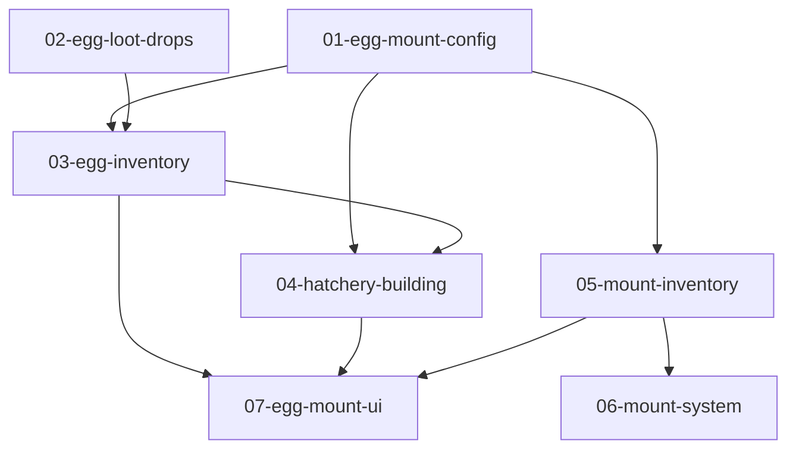

# Mounts and Eggs - Work Packages

## Overview
Implement a mount system where dinosaurs hatch from eggs. Features include egg drops from enemies, egg tier combining, hatchery building for incubation, mount perks (speed boost, resource bonuses, instant kill), and breeding.

## Core Mechanics
- **Eggs**: Rare drops from dinosaurs (5% base), 5 tiers, combine 3→1 to upgrade
- **Hatchery**: Building at home outpost to incubate eggs into mounts
- **Mounts**: Rideable dinosaurs with perks, drain stamina while riding
- **Breeding**: Store mounts in hatchery to passively generate eggs

## Dependency Graph

## Work Units

| File | Status | Priority | Depends On | Complexity | Claimed By |
|------|--------|----------|------------|------------|------------|
| 01-egg-mount-config.md | pending | 1 | none | medium | - |
| 02-egg-loot-drops.md | pending | 1 | none | low | - |
| 03-egg-inventory.md | pending | 2 | 01 | medium | - |
| 04-hatchery-building.md | pending | 2 | 01, 03 | high | - |
| 05-mount-inventory.md | pending | 2 | 01 | medium | - |
| 06-mount-system.md | pending | 3 | 05 | high | - |
| 07-egg-mount-ui.md | pending | 4 | 03, 04, 05 | high | - |

## Integration Order

1. **Wave 1 (Parallel)**: Config (01) + Loot Drops (02)
2. **Wave 2 (Parallel)**: Egg Inventory (03) + Mount Inventory (05)
3. **Wave 3**: Hatchery (04) + Mount System (06)
4. **Wave 4**: UI (07)

## Shared Resources (Coordination Required)
- `EntityConfig.js` - Packages 01, 02 add config
- `GameConstants.js` - Multiple packages add events
- `Hero.js` - Packages 03, 05 add components
- `index.html` - All packages add script tags

## New Files Created
- `src/components/EggInventoryComponent.js`
- `src/components/MountInventoryComponent.js`
- `src/gameplay/Building.js`
- `src/gameplay/HatcheryBuilding.js`
- `src/systems/BuildingSystem.js`
- `src/systems/MountSystem.js`
- `src/ui/EggUI.js`
- `src/ui/MountUI.js`
- `src/ui/HatcheryUI.js`

## Design Decisions
- Eggs stored in separate component, not main inventory
- Mounts are instances (can own multiple of same type)
- Buildings are a new system (first building = hatchery)
- Perks are config-driven, not hardcoded
