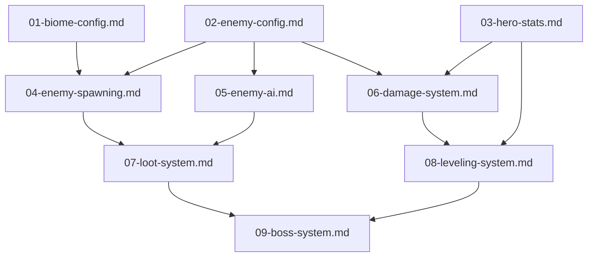

# Open World Biomes - Work Packages

## Overview
Implement open world biomes (Grasslands, Tundra, Desert, Lava Crags) extending organically from the zone grid. Features hostile enemies, combat, XP leveling, loot tables, and boss encounters.

## Terminology
- **Zones** = Safe areas with passive dinosaurs (existing system)
- **Biomes** = Open world hostile areas extending from zones
- **enemy_dinosaur** = Hostile dinosaur enemies that attack the player
- **enemy_soldier** = Hostile human enemies that attack the player

## Geography
- Biomes extend organically outward from the existing zone grid
- Players can freely travel to any biome at their own risk
- Biome boundaries blend together in transition zones
- Future task: Define organic ecosystem logic for biome layout

## Design Features (Approved)
- **Threat Level Indicators**: Visual rings around enemy groups showing danger
- **Pack Behavior**: Grouped enemies aggro together (configurable per type)
- **Elite Enemies**: Rare 2x stats, 3x loot variants
- **Transition Zones**: Gradient borders mixing enemy types between biomes
- **Respawn Waves**: Groups respawn together to maintain pack integrity

## Dependency Graph

## Work Units

| File | Status | Priority | Depends On | Complexity | Claimed By |
|------|--------|----------|------------|------------|------------|
| 01-biome-config.md | pending | 1 | none | medium | - |
| 02-enemy-config.md | pending | 1 | none | medium | - |
| 03-hero-stats.md | pending | 1 | none | medium | - |
| 04-enemy-spawning.md | pending | 2 | 01, 02 | high | - |
| 05-enemy-ai.md | pending | 2 | 02 | high | - |
| 06-damage-system.md | pending | 2 | 02, 03 | medium | - |
| 07-loot-system.md | pending | 3 | 04, 05 | medium | - |
| 08-leveling-system.md | pending | 3 | 03, 06 | medium | - |
| 09-boss-system.md | pending | 4 | 07, 08 | high | - |

## Integration Order

1. **Wave 1 (Parallel)**: BiomeConfig, EnemyConfig, HeroStats
2. **Wave 2 (Parallel)**: EnemySpawning, EnemyAI, DamageSystem
3. **Wave 3 (Parallel)**: LootSystem, LevelingSystem
4. **Wave 4**: BossSystem (final integration)

## Shared Resources (Coordination Required)
- `EntityConfig.js` - Multiple packages add to this file
- `EntityTypes.js` - Need to add ENEMY_DINOSAUR, ENEMY_SOLDIER types
- `Events.js` - Multiple packages add events
- `GameConstants.js` - Biome/combat constants

